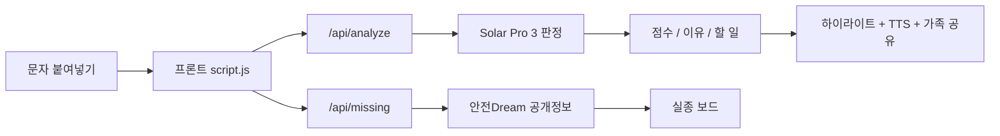

# 안심체크 — 이 문자 진짜예요?

부모님 세대를 노리는 **스미싱·보이스피싱 문자를 붙여넣기만 하면**, 국내 AI가 위험 여부와 이유를 알려 주는 웹 서비스입니다.

<p align="center">
  
</p>

[](https://anshim-check.vercel.app)
[](https://www.upstage.ai/)
[](#-서비스-구조)

- **바로 써보기:** https://anshim-check.vercel.app
- 설치·가입·로그인 없이 링크만 열면 바로 사용
- 모바일에서 **홈 화면에 추가**하면 앱처럼 바로 켤 수 있습니다

> 2026 리부트 AI 활용대회 산출물. **국내 LLM Upstage Solar Pro 3**를 메인 판정 엔진으로 사용했습니다.  
> Claude Code / Codex / Grok은 구현·QA 보조로만 사용했습니다.

---

## 한 줄 요약

**교육에서 배운 국내 LLM을, 부모님 문자 확인이라는 실제 생활 문제에 붙인 무설치 웹 서비스.**

| 구분 | 내용 |
|---|---|
| 문제 | 사기 문자가 왔을 때, 부모님이 혼자 바로 확인하기 어렵다 |
| 해결 | 붙여넣기 한 번으로 위험 점수·이유·지금 할 일을 보여 준다 |
| 메인 AI | **Upstage Solar Pro 3** |
| 배포 | Vercel (프론트 + 서버리스 API) |
| 원칙 | 입력 문자 미저장 · AI 판정은 참고용 · 공식 기관 안내 |

---

## 왜 만들었나

- 사기 문자·전화는 계속 늘고, 특히 **어르신이 가장 취약**합니다.
- 사기범은 **불안과 다급함**을 무기로 씁니다. 정작 위급한 순간엔 자녀에게 물어볼 생각조차 못 합니다.
- 기존 확인 수단은 **앱 설치·계좌·로그인**을 요구해서, 정작 필요한 어르신이 쓰기 어렵습니다.

그래서 **설치도 가입도 없이, 문자를 붙여넣기만 하면 되는** 가장 낮은 문턱을 목표로 했습니다.

---

## 무엇을 하나

1. **사기 문자 확인** — 의심 문자·카톡을 붙여넣으면 Solar가 `위험 점수(0~100)` + `높음/중간/낮음` + `의심되는 이유` + `지금 할 일`을 쉬운 말로 알려 줍니다.
2. **예시 카드** — 아직 붙여넣을 문자가 없어도 건강보험·택배·검찰·가족사칭 예시를 눌러 바로 체험할 수 있습니다.
3. **위험한 부분 하이라이트** — 링크·전화번호·계좌형 숫자·위험 키워드를 노랗게 표시합니다.
4. **가족에게 보내기** — 결과 요약을 공유 시트 또는 클립보드로 전달합니다.
5. **읽어주기** — 결과 점수와 지금 할 일을 한국어 TTS로 낭독합니다. (지원 기기만)
6. **홈 화면에 추가 (PWA)** — 모바일에서 아이콘으로 바로 켤 수 있습니다.
7. **통화 중 3원칙** — 실시간 전화는 붙여넣을 수 없으므로, 통화 중 행동 원칙을 항상 노출합니다.
8. **실종자 함께 찾기** — 광고 대신 경찰청 안전Dream 공개정보를 앨범형 보드로 보여 줍니다.
9. **공식 상담 안내** — 피싱안심SOS · 1394 · 금감원 1332 · 실종 182.

---

## 서비스 구조

<p align="center">
  
</p>

<p align="center"><sub>개념 이미지 · 실제 요청 경로는 아래 구조도를 기준으로 보세요</sub></p>

### 한눈에 보기

| 단계 | 누가 | 무엇을 |
|---|---|---|
| 1 | 사용자 | 의심 문자/카톡을 붙여넣거나 예시 카드를 누름 |
| 2 | 프론트엔드 | 입력 검증 후 `/api/analyze` 호출, 결과 화면 구성 |
| 3 | Vercel Function | API 키 보호, Solar 프롬프트 전달, 응답 중계 |
| 4 | Solar Pro 3 | 위험점수·위험도·이유·지금 할 일 생성 |
| 5 | 프론트엔드 | 하이라이트, TTS, 가족 공유, 공식 상담 안내 |
| 병행 | `/api/missing` | 경찰청 안전Dream 공개정보 보드 표시 |

### 전체 흐름

```text
[사용자 폰 / 브라우저]
   │  1) 의심 문자 붙여넣기
   │  2) 예시 카드 체험 / 가족 공유 / TTS
   ▼
[프론트엔드]
  index.html + script.js + style.css + PWA(sw.js)
   │
   ├─ POST /api/analyze  ──────────────────────────────┐
   │                                                   ▼
   │                                         [Vercel Function]
   │                                           api/analyze.js
   │                                                   │
   │                                                   ▼
   │                                         [Upstage Solar Pro 3]
   │                                      위험점수 · 위험도 · 이유 · 할 일
   │                                                   │
   │◄────────────── JSON 응답 ──────────────────────────┘
   │
   └─ GET /api/missing  ───────────────────────────────┐
                                                       ▼
                                             [Vercel Function]
                                               api/missing.js
                                                       │
                                                       ▼
                                           [경찰청 안전Dream OpenAPI]
                                              실종 공개정보 + 사진
```

### 한 번의 확인이 지나가는 길



### 역할 분리

```text
┌───────────────────────────────┐
│ 메인 판정 엔진                │
│ Upstage Solar Pro 3           │
│ - 문자 위험도 판정            │
│ - 이유 / 지금 할 일 생성      │
└───────────────────────────────┘

┌───────────────────────────────┐
│ 서버리스 보호막               │
│ Vercel Functions              │
│ - API 키를 서버에만 보관      │
│ - 입력 문자는 저장하지 않음   │
│ - 간단 레이트리밋             │
└───────────────────────────────┘

┌───────────────────────────────┐
│ 프론트엔드                    │
│ Vanilla HTML/CSS/JS + PWA     │
│ - 시니어 가독성 우선          │
│ - 하이라이트 / 공유 / TTS     │
│ - 홈 화면 추가                │
└───────────────────────────────┘

┌───────────────────────────────┐
│ 개발 보조 (메인 아님)         │
│ Claude Code / Codex / Grok    │
│ - 구현·리팩터·QA 보조         │
└───────────────────────────────┘
```

---

## 기술 스택

```text
                    ┌──────────────────────┐
                    │   사용자 브라우저    │
                    │  Chrome / Safari 등  │
                    └──────────┬───────────┘
                               │
                ┌──────────────▼──────────────┐
                │     정적 프론트 + PWA        │
                │  HTML / CSS / Vanilla JS     │
                │  manifest + service worker   │
                └───────┬──────────────┬──────┘
                        │              │
           POST /api/analyze     GET /api/missing
                        │              │
            ┌───────────▼──┐    ┌──────▼──────────┐
            │ analyze.js   │    │ missing.js      │
            │ Vercel Fn    │    │ Vercel Fn       │
            └───────┬──────┘    └──────┬──────────┘
                    │                  │
         ┌──────────▼─────────┐  ┌─────▼──────────────┐
         │ Upstage Solar      │  │ 경찰청 안전Dream   │
         │ Pro 3 (solar-pro3) │  │ OpenAPI            │
         └────────────────────┘  └────────────────────┘
```

| 구분 | 사용 | 역할 |
|---|---|---|
| **메인 AI** | **Upstage Solar Pro 3** (`solar-pro3`) | 문자 위험도 판정, 근거, 대처법 생성 |
| 프론트엔드 | HTML / CSS / JavaScript | 프레임워크 없이 가볍게, 시니어 가독성 우선 |
| PWA | `manifest.webmanifest` + `sw.js` | 홈 화면 추가, 정적 셸 오프라인 폴백 |
| 서버리스 | Vercel Functions (Node.js) | API 키 보호, `/api/analyze`, `/api/missing` |
| 외부 데이터 | 경찰청 안전Dream OpenAPI | 실종 공개정보 보드 |
| 개발 보조 | Claude Code / Codex / Grok | 코딩·QA 보조 도구로만 사용 |

### 폴더 구조

```text
anshim-check/
├─ index.html              # 메인 화면
├─ style.css               # 시니어 친화 UI
├─ script.js               # 입력/판정/공유/TTS/실종보드
├─ sw.js                   # service worker (network-first)
├─ manifest.webmanifest    # PWA 설정
├─ favicon.svg
├─ assets/                 # 아이콘, 마스코트
├─ api/
│  ├─ analyze.js           # Solar 판정 프록시
│  └─ missing.js           # 안전Dream 프록시
├─ .env.example
└─ README.md
```

---

## Solar를 어떻게 썼나

단순 호출이 아니라, 실제 사기 유형을 다섯 가지로 정리해 **한국어 판정 프롬프트를 직접 설계**했습니다.

```text
입력 문자
   │
   ▼
[5유형 기준으로 읽기]
 1) 링크형
 2) 사칭·협박형
 3) 기관 콜백형
 4) 가족 긴급송금형
 5) 링크 미끼형
   │
   ▼
[안전 규칙 적용]
 - 입력에 없는 내용은 지어내지 않는다
 - 애매하면 낮음이 아니라 중간으로 판단한다
 - 의심 이유와 위험도는 반드시 일치해야 한다
   │
   ▼
[출력]
 위험점수 0~100
 위험도 높음/중간/낮음
 의심되는 이유
 지금 할 일
```

점수 구간:

| 점수 | 위험도 |
|---:|---|
| 0~29 | 낮음 |
| 30~69 | 중간 |
| 70~100 | 높음 |

---

## 만든 과정 (시행착오)

- 초기 프롬프트는 **근거는 사기인데 위험도는 '낮음'**으로 나오는 모순이 있었습니다. 점수-위험도 일치 규칙으로 잡았습니다.
- **평범한 가족 문자에 없는 위험 요소를 지어내는** 문제도 있어, "입력에 없는 내용은 만들지 말 것" 규칙을 넣었습니다.
- 실제 사기/정상 문자 표본으로 QA를 돌렸습니다.
  - 페르소나 시나리오 **10/10**
  - 고난도 사기 문자 **15/15**
  - 점수 경계 테스트 **8/10** (남은 2건은 장애가 아니라 경계 판정 차이)
- 실종정보 API 사진이 URL이 아니라 **base64 원문**으로 온다는 걸 발견해 data URI로 처리했습니다.
- 하단 영역을 **광고 대신 공익 실종 보드**로 두어, 확인 직후 시선이 머무는 자리를 공익 정보로 채웠습니다.

---

## 개인정보 · 윤리

- 입력한 문자 내용을 **저장하지 않습니다.** (서버는 API 키만 보관)
- 실종정보는 경찰청 공개 자료이며 화면에 **자료 출처: 경찰청**을 표기합니다.
- AI 판정은 **참고용**입니다. 확실하지 않으면 **피싱안심SOS · 1394 · 1332** 또는 가족에게 확인하세요.
- 실시간 통화(보이스피싱) 자체는 분석하지 않습니다. 통화 중 3원칙으로 보완합니다.

---

## 한계

- AI가 틀릴 수 있습니다. 최종 판단은 공식 기관 확인을 권합니다.
- TTS·Web Share는 기기·브라우저에 따라 지원이 다를 수 있습니다. (미지원 시 버튼 숨김 또는 클립보드 복사)
- 카톡 등 일부 인앱 브라우저에서는 홈 화면 추가가 막혀 있어, 외부 브라우저로 여는 안내를 제공합니다.

---

## 로컬 실행

```bash
# 1) 환경변수
cp .env.example .env
# UPSTAGE_API_KEY=...
# SAFE182_ESNTL_ID=...
# SAFE182_AUTH_KEY=...

# 2) 로컬 서버
npx vercel dev
```

필수 환경변수:

| 키 | 용도 |
|---|---|
| `UPSTAGE_API_KEY` | Solar 판정 API |
| `SAFE182_ESNTL_ID` | 안전Dream 고유아이디 |
| `SAFE182_AUTH_KEY` | 안전Dream 인증키 |

---

## 라이브 / 저장소

- 서비스: https://anshim-check.vercel.app
- 코드: https://github.com/restboy2606/anshim-check

---


---

## 이미지 노트

README 상단 비주얼은 NVIDIA NIM의 `black-forest-labs/flux.2-klein-4b`로 생성한 **개념 이미지**입니다.  
라벨/화살표의 정확한 기술 근거는 위 구조도·mermaid·폴더 구조를 기준으로 합니다.

## 한 줄 다시

**대신 판단해 주는 도구가 아니라, 부모님이 스스로 확인하도록 돕는 도구.**
